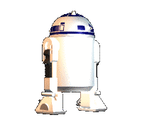

# Planets of Star Wars

A **Next.js** front-end application showcasing planets from the Star Wars universe. This project is part of a front-end challenge by **Ília**.
A simple landing page displays a list of planets. Clicking a planet shows its **detailed info** and **residents**.



---

## Tech Stack

- **Framework:** Next.js 15
- **Styling:** SCSS
- **Testing:** Jest + React Testing Library
- **TypeScript** for type safety

---

## Getting Started

### Prerequisites

- Node.js >= 20
- npm >= 9

### Installation

```bash
git clone <repo-url>
npm install
```

### Run Locally

```bash
npm run dev
```

Open [http://localhost:3000](http://localhost:3000) in your browser.

### Build for Production

```bash
npm run build
npm run start
```

---

## Testing

- Uses **Jest** + **React Testing Library**.

Run tests:

```bash
npm run test
```

Watch mode:

```bash
npm run test:watch
```

---

## Folder Structure

```
illia-challenge/
├─ src/
│  ├─ app/                  # Next.js pages
│  │  ├─ page.tsx           # Planets listing
│  │  └─ planet/[id]/page.tsx # Planet details
│  ├─ components/           # Reusable UI components
│  │  ├─ card/
│  │  ├─ search/
│  │  └─ loading/
│  ├─ interfaces/           # TypeScript types
│  ├─ utils/                # Helper functions and constants
│  └─ styles/               # SCSS variables and global styles
├─ public/                  # Static assets (gif, images)
└─ package.json
```

---
